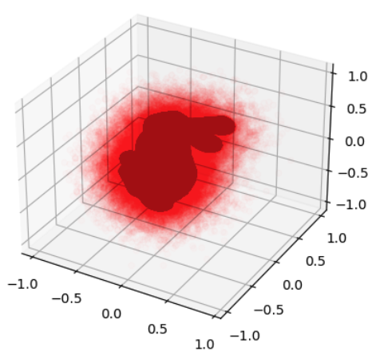

# HW3: Neural Field Reconstruction

In this homework, you will implement a neural network model that reconstructs 3D object from a set of occupancy field samples. The model will consist of a 3D feature grid and a multilayer perceptron (MLP), which will be trained to minimize the difference between the predicted and ground truth occupancy fields.

The objective of the reconstruction task is to generate a plausible 3D occupancy field that captures the overall shape of the object, given a set of occupancy field samples. The occupancy field is represented as a 3D grid of values in {-1, 1}, where -1 means empty space and 1 means occupied space.

__Please make sure that you take a look at lab8 and understand it. This homework is basically a 3D version of this lab__

## Dataset

In the `/data` directory, you will find 3D mesh models of 5 objects. These objects have been processed with the `generate_points.py` script to generate 3D occupancy field samples, which are stored in the `/processed` directory (.obj) files represented as a point cloud. Each point in the point cloud is a sample of the occupancy field, and the value of occupancy is stored in color: red means the point is empty and green means the point is occupied.

All the data can be downloaded using `download_data` function from `utils.py`. You may use [MeshLab](https://www.meshlab.net) to visualize the data

```
from utils import plot_points, download_data

download_data()
plot_points('processed/bunny.obj')
```


## Model Architecture

The neural model consists of a 3D feature grid and an MLP.

The feature grid is a grid that can have a single or multiple levels of details (LoD), where each node contains a feature vector of fixed size. To get a feature vector for a point in space, the feature grid is queried with the point's coordinates, and the output is a feature vector that is a result of interpolation of the feature vectors of the grid nodes that are closest to the point.

The MLP takes the feature vector as input and outputs the occupancy field value for the point. The model is trained to minimize the difference between the output and the ground truth occupancy field.

__Note on HashGrid__: The feature grid can also be represented as a HashGrid. The HashGrid is similar to the grid, with the only difference being that the grid size is much lower, and indexing to the grid is done via hashing. In the case of a regular grid, given a point, the grid is queried explicitly by finding the nearest nodes. However, in a HashGrid, given a point, the grid (hash table) is queried by calculating a hash function and getting the node value from the hash table. The hash function maps a point to a unique integer, which allows for faster indexing and retrieval of values.

## Training

The model is trained on the 3D occupancy field samples. For a fixed 3D object, the data loader should subsample the occupancy field samples and their 3D coordinates to generate a batch of samples. Then, given the position of a point, the feature grid outputs an interpolated feature vector, which is fed into the MLP to produce the predicted occupancy field value. The model is trained to minimize the difference between the predicted and ground truth occupancy fields.

All the training and evaluation are done for a single model optimization; that is, you are training a network to __overfit__ the data. This means that the model is first trained on a single 3D object and then evaluated to predict it. And this is done for each of the 5 3D objects in the `/data` directory. Be aware, that training and evaluation points are __different__: training points are sampled randomly near the object, and evaluation points - are the grid points sampled regularly in space with fixed resolution (see Evaluation below)

## Evaluation

The 'reconstruction.py' file contains functions that will help you evaluate the model. There is also an evaluation of a baseline model. The evaluation is done as follows:

* A regular dense grid is created, which contains the point's positions, resulting in a shape of [resolution, resolution, resolution, 3].
* The values of the grid are divided into batches. These batches are passed to the model, which outputs the occupancy field values for each point in the batch.
* The occupancy field values are stored in a 3D grid with the same shape as the regular dense grid. Then, the marching cubes algorithm is applied to the 3D grid to get the mesh of the reconstructed object.
* The mesh is compared to the ground truth mesh using the Chamfer and Hausdorff distances.

## Grading
__The code grading consists of 3 parts (30 points in total):__
1. Implement of the model with single LoD (10 points)
2. Implement of the model with multiple LoD (10 points)
3. HashGrid (10 points)

Overall, you are expected to conduct a small study and show a presentation. This presentation should visualize and discuss the results of the study . The presentation should be 5-10 minutes long. __Presentation can give you up to 10 points__. The study may include the following:
*  Compare the performance of the model with single LoD and multiple LoD.
*  Compare the performance of the model with HashGrid and regular grid.
*  Compare the performance of the model with different resolutions of the regular dense grid (at reconstructuon stage).
*  ... (you can come up with your own ideas)


Q/A session: after the presentation and during code check you will be asked question about your work. __Q/A: 10 points__

The code will be manually checked for accuracy and completeness, and specific questions may be asked during an in-person check to verify the authorship of the submitted homework.

__The assignment has a maximum score of 50. To determine the final score, we will multiply the grade  by 3/5 to rescale it to a maximum of 30 points.__. 

## Papers
1. [ReLU Fields: Continuous 3D Convolutional Neural Fields for Shape Reconstruction](https://arxiv.org/abs/2205.10824)

Take a look at:
   * Section 3: Method
   * Section 4.2: Occupancy Fields

2. [Instant Neural Graphics Primitives with a Multiresolution Hash Encoding](https://nvlabs.github.io/instant-ngp) 

Take a look at:
   * Section 3: Multiresolution Hash Encoding
   * Figure 3 - the way the HashGrid works
3. [NGLOD: Real-time Rendering with Implicit 3D Shapes](https://nv-tlabs.github.io/nglod/)

Take a look at:
   * Figure 3 - the way features of grid nodes at different LODs are used to predict occupancy/sdf value