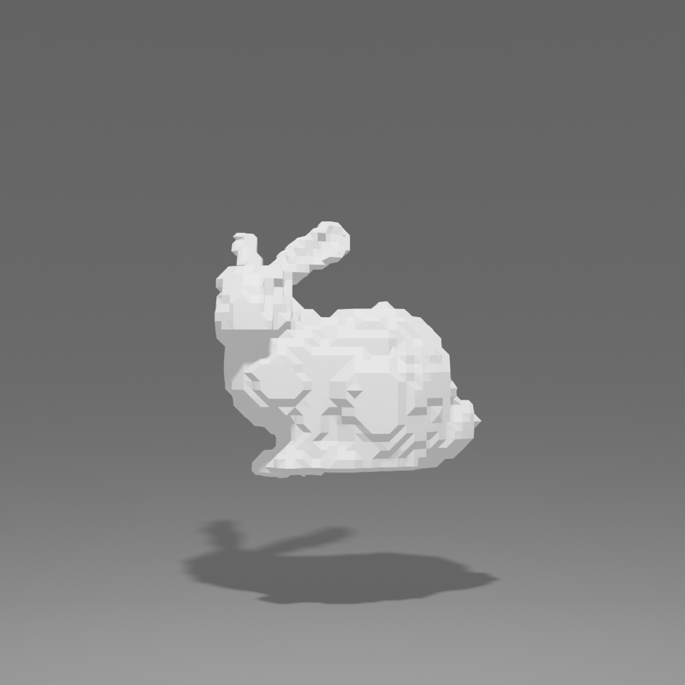

# Neural Field Reconstruction

This repository contains the project for CMPT 985 - 3D Vision, authored by Traven Blaney. The main objective of this project is to develop and evaluate neural network models for reconstructing 3D objects from occupancy field samples. The full report is available at 3dv_hw3_report.pdf

## Introduction

The assignment involves constructing models using a 3D feature grid combined with a multilayer perceptron (MLP) to accurately produce plausible surface reconstructions of various objects based on their occupancy field samples. Three different model types were explored: single Level-of-Detail (LOD), multiple LOD, and hash grid models.

## Models and Training

Each model type was trained with specific hyperparameters aiming to minimize the discrepancy between the predicted and actual occupancy fields. The hash grid model was found to be significantly faster than the others, with comparative loss values indicating varying degrees of accuracy and efficiency across the models.

## Results and Evaluation

The models' performances were evaluated using Chamfer and Hausdorff distances as metrics, with detailed results presented for different objects like bunnies, columns, dragons, serapis, and teapots across various resolutions. Multi-LOD models generally provided better geometric fidelity, especially at higher resolutions, while hash grids faced challenges with detail preservation and outlier management.

The following images show the reconstructions of the bunny model at different resolutions using the multi-LOD method:

<table>
  <tr>
    <th>64 Resolution</th>
    <th>128 Resolution</th>
    <th>256 Resolution</th>
  </tr>
  <tr>
    <td></td>
    <td></td>
    <td></td>
  </tr>
</table>

## Visualizations

Reconstructions were visualized in Blender using the EEVEE render engine, and visual comparisons of the models across different resolutions were included in the submission.

## Discussion

The study discusses the limitations and advantages of single vs. multiple LOD models and compares HashGrid with DenseGrid in handling data. It concludes that multiple LOD models and DenseGrid configurations generally offer better adaptability and detail accuracy, particularly in complex environments.

## Conclusion

The comparative analysis distinctly favors multiple LOD models for their dynamic resolution management, leading to more precise and computationally efficient representations. The study also notes the need for further optimization of HashGrid methods, especially for applications requiring high detail fidelity.
